<div align="center">


# PC GamePak

**Turn removable storage into physical game cartridges.**
Plug one in and a launcher appears with the game's cover art and two buttons.

[](https://github.com/HarryBMa/pc-gamepak/actions/workflows/ci.yml)
[](https://github.com/HarryBMa/pc-gamepak/releases)
[](https://aur.archlinux.org/packages/pc-gamepak)
[](https://github.com/microsoft/winget-pkgs)
[](LICENSE)
[](https://ko-fi.com/harrybma)

<br />

[](#setup)
[](#setup)
[](#setup)
[](#security)
[](#working-on-it)
[](#working-on-it)

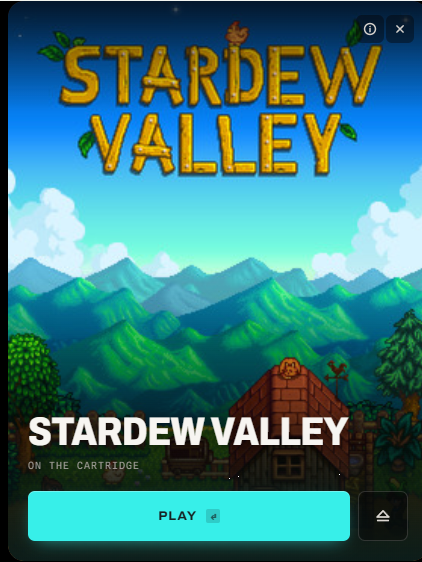

</div>

---

A cartridge is a small drive in a pocketable enclosure with a game on it. Push it
into a USB-C port; the launcher opens showing what's on it. Press **Play** to
start the game, or **Eject** to power the drive down and pull it out.

Each cartridge is just a drive with a `cartridge.conf` text file at its root.
There are no scripts to write and nothing to allowlist, because **nothing on a
cartridge is ever executed automatically** — pressing Play is the gate.

```bash
git clone https://github.com/HarryBMa/pc-gamepak.git
cd pc-gamepak
cd tauri-ui && npm install && npm run build && cd ..

sudo linux/install.sh       # Linux, system install
# or: linux/install-user.sh  # Linux, no root
# Windows: right-click windows/install.ps1 → Run with PowerShell
```

Then plug a drive in, or run `pc-gamepak --create` to make one.

## Contents

**Using it**
&nbsp;&nbsp;[The idea](#the-idea) ·
[The launcher](#the-launcher) ·
[Making a cartridge](#making-a-cartridge) ·
[Getting the most out of a cartridge](#performance) ·
[Tags instead of drives](#tags)

**Building one**
&nbsp;&nbsp;[Hardware](#hardware) ·
[Cartridge format](#cartridge-format) ·
[Setup and install](#setup) ·
[Uninstall](#uninstall)

**Under it**
&nbsp;&nbsp;[How it works](#how-it-works) ·
[Security](#security) ·
[Working on it](#working-on-it) ·
[Packages](#packages)

**Everything else**
&nbsp;&nbsp;[Thanks](#thanks) ·
[Licence](#licence) ·
[Disclaimer](#disclaimer)

Click any heading below to open it.

---

<a id="the-idea"></a>
<details open>
<summary><b>The idea</b> — what a cartridge is, and why</summary>
<br />

It's the console-cartridge feeling, using hardware that already exists — and it
genuinely offloads a game off your internal disk, which is the practical half of
the appeal.

A shelf of cartridges is a library you can hold. Each one carries a game, its
cover art and nothing else, so what is on it is obvious from across the room and
from the drive's own name in Explorer.

The build documented here uses an **M.2 2230 NVMe** stick in a USB enclosure, but
nothing in the software requires that: any removable drive your OS automounts
will do — a SATA SSD in a dock, an SD card, a USB stick, an external HDD. The
form factor is a comfort choice, not a technical one.

</details>

<a id="the-launcher"></a>
<details>
<summary><b>The launcher</b> — one window, cover art, Play and Eject</summary>
<br />

The window is 420 × 560 — the 3:4 of a cover — and the artwork fills it. The
window is the slot and the cover is the cartridge seated in it: press Eject and
the whole face rides out, leaving the empty slot behind.


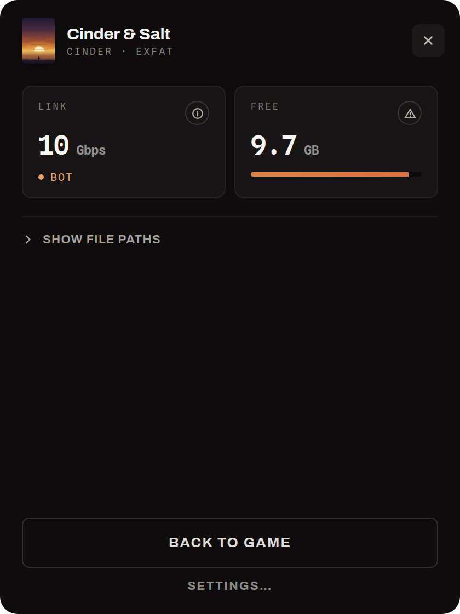

The accent colour is sampled from the cover art at load, so the Play button
belongs to whatever game is in the dock. At rest almost nothing else is on
screen — the buttons in the corner appear when the pointer is in the window,
and everything the launcher knows beyond the title is behind the ⓘ.

### More than one game on a cartridge

A 256 GB drive holds a series, not a game. Put several on one cartridge and the
launcher grows a rail: **picking a game is what Play acts on**, and the artwork
behind it cross-fades to whichever one is selected — no menu, no submenu,
nothing to learn.

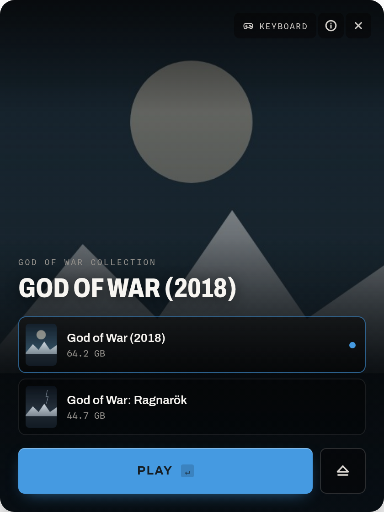

Each row carries the game's own art and size, and the first nine answer to the
number keys — pressing one selects that game and starts it, so the window shows
what it just launched. A cartridge with one game on it has no rail at all.

| Key | Action |
|-----|--------|
| `Enter` | Play the selected game |
| `1`–`9` | Select the *n*th game of a collection and play it |
| `E` | Eject |
| `I` | Details |
| `Esc` | Close details, or dismiss |

### Getting back to the launcher

Press Play and the launcher does not close — it drops to the taskbar and gives
up always-on-top, so it is out of the game's way but still there when the game
is over. Eject is on that window, and quitting a game is exactly when you want
it.

If you do close it, the cartridge is still plugged in and the notification-area
icon is the way back. Left-click opens the launcher for the cartridge you have
in; right-click lists them by name when there is more than one, and carries the
wizard, Settings, and Quit.

The icon belongs to the watcher rather than to the launcher, which is why it is
still there after the window has gone. The watcher is a hidden window and a
message loop and nothing else — see [Idle cost](#idle-cost).

### With a controller

A cartridge next to a television wants a controller, not a mouse. Plug one in
and the launcher picks it up — no setting, and nothing resident: the polling
loop only exists while a pad is connected and the window is open.

| Control | Action |
|---|---|
| D-pad or left stick | Move between the buttons |
| **A** | Press the focused button |
| **B** | Back out of details, or dismiss |
| **Y** | Details |
| **Start** | Play the selected game |

The cursor starts on Play — on a collection too, since one game is already
selected — so a pad and a cartridge is: plug in, press A. The rail is one
d-pad press away when you want a different game. Holding a direction repeats
after a pause, and a controller can only move focus and click — exactly what a
person at the keyboard can reach, and nothing more.

With a pad connected the prompts change with it: the keycaps give way to each
action's own icon, because face-button lettering differs between Xbox,
PlayStation and Switch and a printed **A** would be wrong on two of the three.
The chip in the corner overrides the guess when the hardware gets it wrong.

The wizard is deliberately not controller-driven. Making a cartridge is a
desk job.

</details>

<a id="making-a-cartridge"></a>
<details>
<summary><b>Making a cartridge</b> — the wizard: pick a game, pick a drive, Write</summary>
<br />

Run the installer menu and choose **Create a cartridge**, or start it directly:

```bash
pc-gamepak --create
```

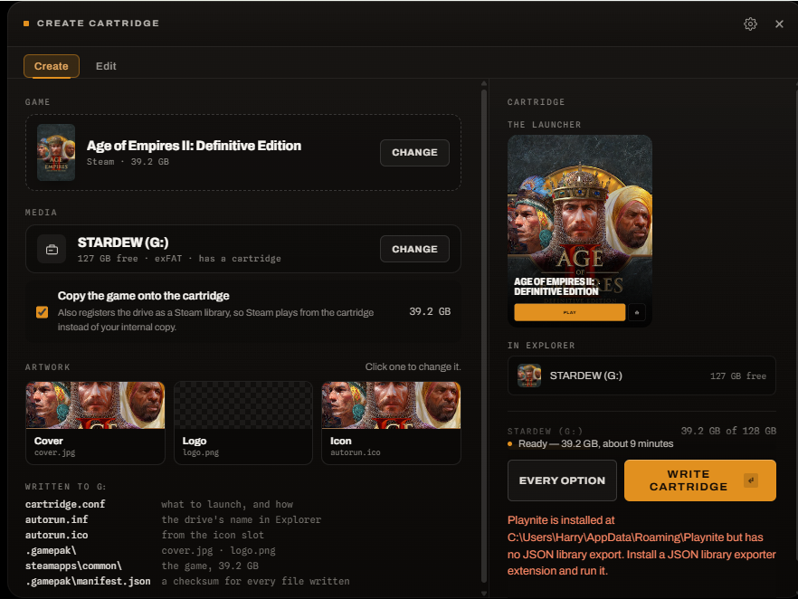

The wizard lists everything installed. **Playnite** is read first when present —
one list covering Steam, GOG, Epic, Xbox, Ubisoft, itch and emulators — and
Steam's own manifests are read too, which is the only source on Linux. Cover art
comes from whichever cache the game came from, so **nothing is fetched**; the
wizard **works offline**, with the optional SteamGridDB integration switched
off — see [Artwork from SteamGridDB](#artwork-from-steamgriddb) to turn it on.

Playnite is detected automatically on Windows (the standard `%APPDATA%\Playnite`
location and portable installs in `Program Files`) and on Linux through every
Proton `compatdata` prefix that contains a Playnite install. If detection fails,
a **Playnite data folder** field appears at the bottom of the game list so you
can point the wizard at the right directory.

> **Note:** Playnite stores its library in a binary database. The wizard reads a
> JSON export instead — install a library-exporter extension in Playnite and run
> it once before using the wizard. Any extension that writes a `library.json` or
> `games.json` file will work.

Pick a game, pick the media, press Write. It is **one screen**: Game, Media,
Artwork and what gets written, each stating what is currently chosen with a
**Change** beside it — so nothing has to be finished before the next thing can
be looked at, and there is no step to go back to.

**Change** opens the library as a dialog, and it is a real list with tick boxes:
selection is always multiple, so ticking a second game is all it takes. The rail
on the right titles itself **Cartridge** or **Multicartridge** to match. There is
no mode to enter.

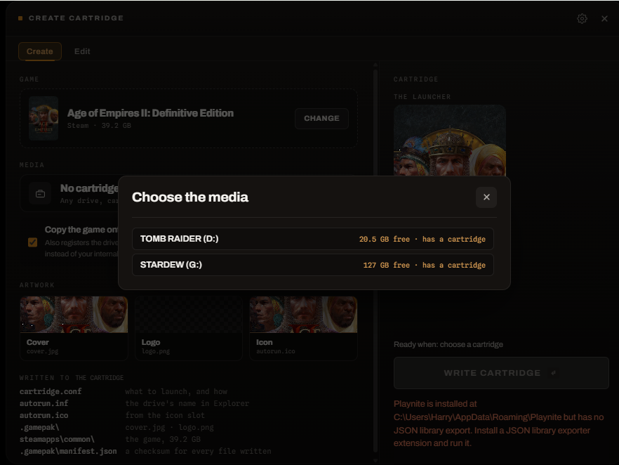

Media is the same dialog asking the same kind of question. Every removable drive
is listed with the room on it, and one that already holds a cartridge says so
before you overwrite it.

The rail is a **live preview of the launcher** this cartridge will open — the
cover behind, the logo or the title over it, Play in the colour sampled from the
art. It is the only place that answers the question a thumbnail cannot: whether
the title is still readable on the picture you just chose.

### Collections

Tick a second game and the cartridge is a collection — nothing else to press.
The rail counts them, and the bar under it puts one band per game so you can see
which one is taking the room:

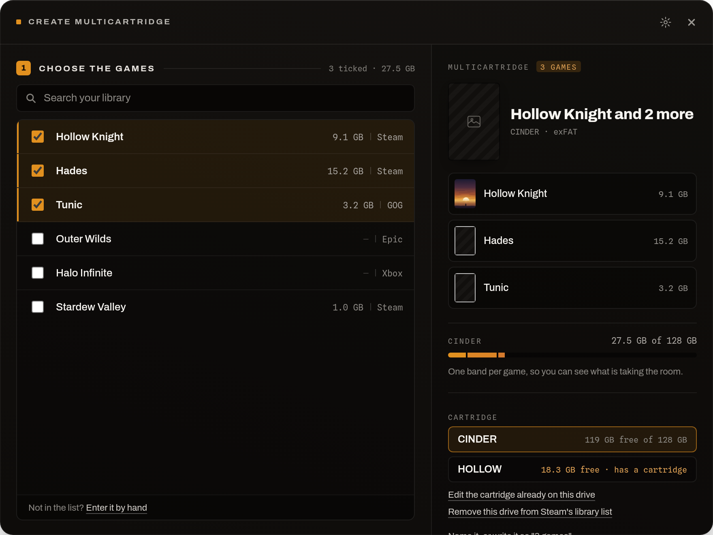

A collection is the one thing in a library with no artwork of its own, so a
**Name and order** group appears on the same screen for the two things the wizard
cannot work out — what to call it, and what it should look like:

- **The name** is suggested from what the games share — *God of War* and *God of
  War Ragnarök* give *God of War Collection* — and can be typed over. The drive
  itself takes a squeezed version of it, because exFAT allows 11 characters.
- **The artwork** is whatever picture you point at, or the first game's cover if
  you would rather borrow one. Without either, the launcher shows a placeholder.
- **The order** is drag-to-reorder, and it is the order the games appear in on
  the launcher's rail.

A single game never sees that step: it takes its name and its art from itself.

Copying works the same for a collection as for a single game: tick the box and
every game goes across, each entry pointing at its own copy.

### Changing a cartridge you already made

Everything a cartridge says about itself is two small files and a picture, so
renaming one, fixing a typo or swapping its art should not mean writing the
whole thing again — which, with the games copied onto it, is hours.

Select a drive that already holds a cartridge and **Edit the cartridge already
on this drive** appears:

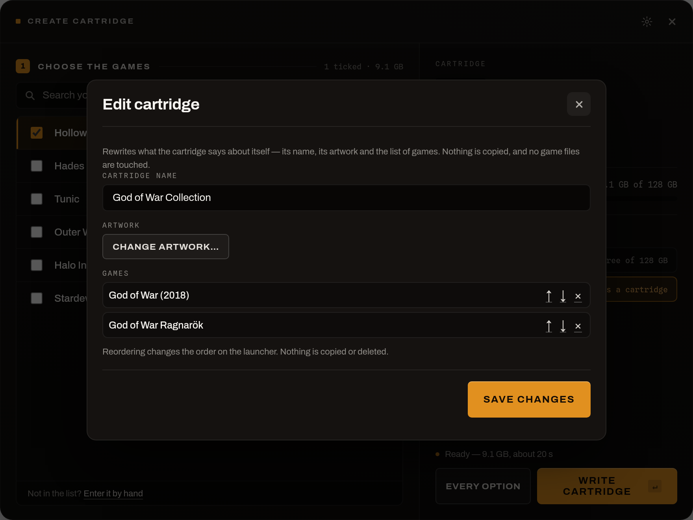

You can rename the cartridge, change its artwork, rename the individual games,
reorder them — the order is the order of the launcher's rail — and take one off
the list. Adding a game means writing the cartridge again, since that is when files
move.

**Nothing here copies or deletes a game.** Taking a game off the list leaves its
files exactly where they are; the launcher simply stops offering it. A cartridge
that ends up with one game on the list becomes an ordinary single-game cartridge
again, and one that gains a second becomes a collection.

### Checking the copy

`std::fs::copy` reports success for every byte the kernel accepted, which is not
the same as every byte arriving on the drive. When a copy over USB goes wrong it
goes wrong quietly, and you find out later, in a level you have not played yet.

**Check the copy afterwards** sums every file with CRC-32 as it is written —
free next to a USB write — then reads the cartridge back and compares. It names
what is wrong rather than just failing: a missing file, a half-written one with
both byte counts, or one that arrived with different contents.

It is opt-in because it costs one extra pass over the drive, so it roughly adds
the time the copy itself took. The file list is left on the cartridge at
`.gamepak/manifest.json`, so the same check can be run later on a machine that no
longer has the original.

This is an integrity check, not a signature: CRC-32 is the right tool for *did
this survive the cable*, the job it does in zip and gzip, and the wrong tool for
*did somebody change this on purpose*.

### What it can put on the cartridge

**The launcher files** — `cartridge.conf` and the cover art. Always written.

**The drive's name and icon** — an `autorun.inf` with `label=`, so Explorer shows
*HOLLOW KNIGHT* rather than *Removable Disk (D:)*. The `icon=` key is written
when a usable `.ico` can be produced; Explorer will not take a JPEG, so a
Steam-sourced cover usually leaves the default icon in place. On by default, and
a tick box under **The cartridge itself** when you would rather the drive stayed
plain.

**The game itself**, by whichever route suits where it came from:

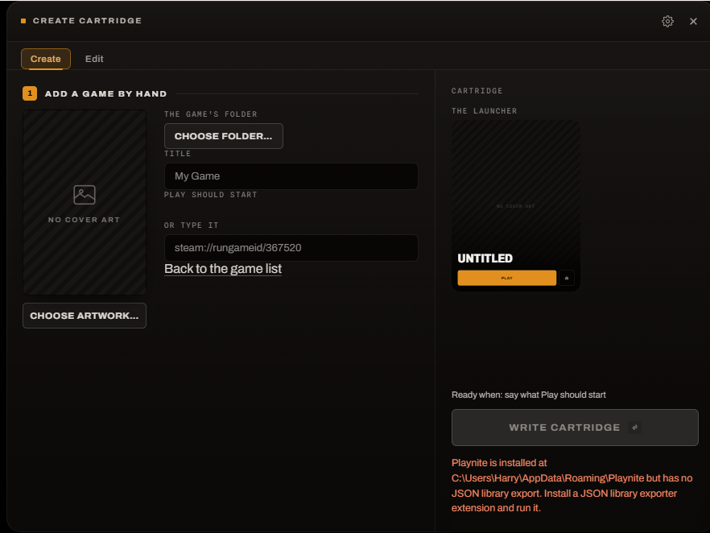

- *Steam games* go to `steamapps/` and the drive is registered in Steam's
  `libraryfolders.vdf`, so Steam plays **from the cartridge** rather than your
  internal copy. Steam rewrites that file from memory when it exits, so it has to
  be closed first — the wizard offers to do that for you, and does it before
  anything on the drive is touched.
- *Rewriting a cartridge Steam already knows about* takes the old entry out of
  that list first, so a repurposed drive does not leave Steam pointing at a
  library that no longer holds the game.
- *Everything else* — GOG, itch, emulator builds, anything Playnite records an
  install folder for — is copied to `Games/<title>/` and Play is pointed at a
  file inside it. No launcher in the middle. The wizard ranks the executables it
  finds (Playnite's own play action first, then a binary named after the game;
  uninstallers and redistributables sink) and offers the best guess, which you
  can change.

**Games in no library at all** — an itch download, a folder nothing scanned —
are entered by hand: point at the folder and the wizard ranks the programs
inside it, saying which it thinks are uninstallers or runtimes rather than
hiding them, and tidies a title out of the folder name for you to correct. There
is no art to inherit for these, so the cover is honestly empty until you give it
one. Any supported URI or a path on the cartridge works too.

<a id="artwork-from-steamgriddb"></a>

### Artwork from SteamGridDB

Some games have no cached art at all — anything added to Playnite by hand,
emulator entries, older GOG titles — and the launcher then shows a placeholder.
The wizard can look artwork up on [SteamGridDB](https://www.steamgriddb.com/)
to fill those gaps.

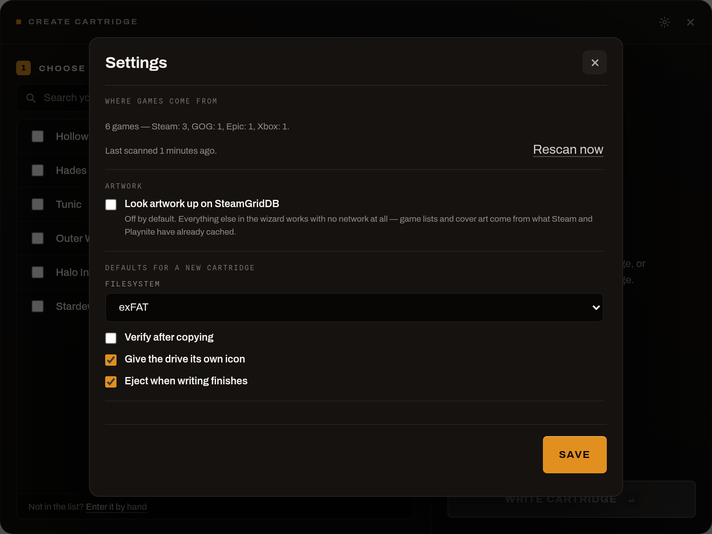

**It is off by default**, and it is the only part of this project that talks to
the network. Turn it on behind the gear in the wizard's title bar, where it also
asks for a personal API key — their API refuses unauthenticated requests, so the
lookup does nothing without one. The key is stored on this machine only, next to
the artwork cache, and the backend refuses every request while the setting is
off, so hiding the button is not the only thing keeping it quiet.

With it off you can still give a cartridge any picture you like: **Choose
artwork…** opens the desktop's own file dialog and copies whatever you point at.

### Formatting erases the drive

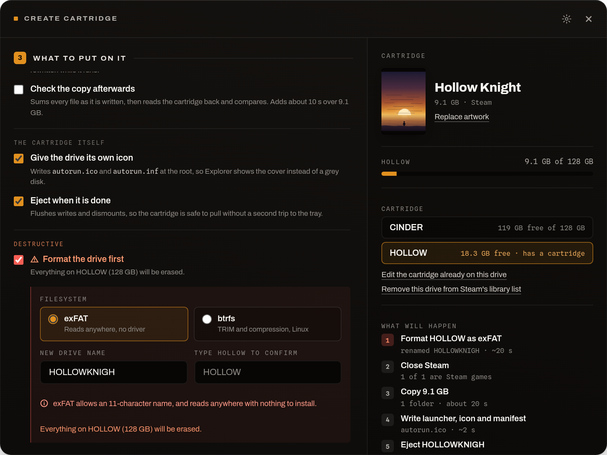

Formatting is opt-in per cartridge and gated three ways: the target must be on
the removable-drive allowlist the wizard re-derives itself, it must not be the
system drive, and it must have been asked for explicitly. All three are checked
in the backend, which re-derives them rather than trusting the window's idea of
where to write, and the plan on screen names the drive and what is on it before
anything runs.

### Which filesystem

**exFAT is the default, and it is the right answer for a cartridge you hand to
someone.** Windows, Linux and macOS all read it with nothing to install, which
is the entire point of a thing you carry between machines.

**btrfs is there for enthusiasts**, and it is a real choice with real costs:

- It brings TRIM (`discard=async`) and transparent zstd compression
  (`compress=zstd`).
- Windows cannot read it at all without [WinBtrfs](https://github.com/maharmstone/btrfs),
  a third-party kernel driver — so a btrfs cartridge only opens on machines you
  have prepared.
- Neither benefit is as large here as it sounds. TRIM only reaches the drive if
  the USB bridge speaks UASP and passes UNMAP through, which many enclosures do
  not; and game data is already compressed, so zstd typically buys single-digit
  percentages in exchange for CPU on every read. A cartridge is also written
  once and read for years, which is the workload flash wear cares least about.

Pick btrfs if your cartridges live on Linux machines you control and you want
the filesystem's other properties. Otherwise exFAT.

The drive name follows the filesystem: exFAT allows 11 characters, btrfs has
room for the whole title. On Linux the relevant mount options are set by the
desktop environment or `/etc/fstab`.

</details>

<a id="performance"></a>
<details>
<summary><b>Getting the most out of a cartridge</b> — what actually causes stutter, in order</summary>
<br />

A game running from a cartridge is running over USB, and USB is the slowest
part of the machine. Most of what people blame on that is not actually the
drive, so this is in order: check the boring things first, then the storage.

### It is usually not the storage

**Shader compilation.** Modern DX12 and Vulkan games compile pipeline state
objects the first time each one is needed, and that stutter looks exactly like a
slow disk. The compiled cache lives on your internal drive, not the cartridge,
and it is keyed to GPU *and* driver version — so moving a cartridge to a second
PC, or updating your driver, throws it away and the first hour stutters again.

- NVIDIA Control Panel → Manage 3D settings → **Shader Cache Size → 10 GB** or
  Unlimited. The default is small enough that a big game evicts its own cache.
- On Steam, leave **Shader Pre-Caching** on. On Linux it is doing most of the
  work for you.

**VRAM.** A texture pool set above your VRAM budget spills over PCIe and hitches
in a way that reads as storage. Drop textures one notch and see whether the
stutter goes before touching anything else.

Neither of these gets better with a faster cartridge.

### The connection, which the launcher will tell you about

Press `I` on the launcher and it reports three things about the drive in front
of it:

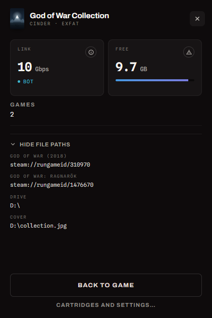

- **Link** — 10 Gbps is what a Gen 2 enclosure should negotiate. 5 Gbps means a
  front-panel port, a hub, or a cable that is not rated for it; 480 Mbps means
  USB 2.0, and games will stream badly.
- **Transport** — **UASP** queues commands; **BOT** sends one at a time. On the
  small random reads a game streams that is worth roughly two to three times as
  much, and which one you get depends on the enclosure's firmware and the port.
- **Space** — see below.

### Leave the drive some room

Almost every M.2 2230 drive is DRAM-less. On an internal slot that is fine: it
borrows host RAM over PCIe — the **Host Memory Buffer** — to hold its flash
translation table. **A USB bridge does not provide HMB**, so the translation
table is paged from the flash itself, and it gets worse the fuller the drive is.

Keep roughly **15% free** and the difference is measurable on random reads. The
wizard says so when a cartridge crosses 85%, and the launcher repeats it.

Free space only helps if the drive knows about it, which is what TRIM is for,
and nothing sends TRIM to removable media on a schedule. The wizard offers
**Release freed space back to the drive** when it is not formatting. Some
enclosures do not pass the command through at all — it will say so plainly if
yours is one of them, which is a good reason to keep the headroom anyway.

### Windows settings worth changing

The wizard's **Tune Windows for this cartridge** does the first two, per
cartridge, showing the exact commands first and offering to undo them:

- **Defender exclusion.** Real-time scanning walks a freshly copied 60 GB game
  the first time anything reads it, competing for the link you are trying to
  stream over.
- **Search indexing off** for the volume, for the same reason in the background.

The Defender exclusion is the one with a memory. `Add-MpPreference` records a
*path*, and the only path a cartridge has is a drive letter Windows hands out
from whatever is free — so the cartridge that was `D:` last week is `H:` today,
and `D:` is now something else nobody chose to stop scanning. Tuning a cartridge
therefore also takes back any exclusion left on a bare drive root that no longer
holds a cartridge. Those removals are in the plan with everything else, so an
exclusion you added yourself can be seen before you agree to the prompt; only
bare roots are ever offered, never a path any deeper.

A cartridge that is unplugged when you tune another one will have its exclusion
taken back too — there is no way to tell an unplugged cartridge from a letter
that has moved on. Tuning it again when it is next plugged in puts it back.

The third is worth doing by hand, once per cartridge:

- **Device Manager → Disk drives → your cartridge → Policies → Better
  performance.** Windows sets removable drives to *Quick removal*, which turns
  write caching off entirely. *Better performance* is the right setting for a
  drive that is always ejected properly — which is what this launcher's Eject
  button is for. It is left as a manual step because the supported way to set it
  is that dialog; the registry keys behind it are per-device and undocumented,
  and this tool does not guess at those.

### If a cartridge will not eject

Eject asks the PnP manager to stop the device, the same way Safely Remove
Hardware does. When that is refused it elevates and takes the volume by force,
locking and unmounting the filesystem — because Windows calls an NVMe stick in a
USB enclosure a *fixed* disk and will not give a fixed volume write access to
anyone else. That is what the UAC prompt is for, on a drive you are only trying
to unplug.

If it still reports the cartridge in use with administrator already granted,
then files really are open on it, and the obvious candidates are not always the
ones holding it. A cartridge that has just been plugged in ejects every time; a
cartridge that has had a game played from it can stay busy afterwards and, on
some machines, does not let go until it is replugged. A Defender exclusion does
not change this — that was tried.

So when one refuses: unplug it, plug it back in, and eject before opening
anything on it.

### If a cartridge gets no drive letter

A volume with no letter has no path, so nothing can see it — not the launcher,
not the wizard, not Explorer. It is not a fault in the drive and rescanning will
not find it, because there is nothing to look at.

Windows normally hands out a letter on its own. When it stops, it is usually
because automount has been turned off, which some disk and imaging tools do
without saying so, and which is remembered across reboots:

```powershell
# In an admin PowerShell. 1 means automount is off.
(Get-ItemProperty HKLM:\SYSTEM\CurrentControlSet\Services\mountmgr).NoAutoMount

mountvol /E   # turn it back on
```

The tell is that drives you have lettered by hand keep coming back and new ones
never get one at all: the manual assignments are remembered per volume in
`HKLM\SYSTEM\MountedDevices`, and everything else falls through. Those entries
key on the partition, not the port, so moving a cartridge to a different socket
changes nothing.

`mountvol /E` does not letter a drive that is already plugged in — unplug and
replug it, or use the wizard. Cartridges Windows can read but has not lettered
show up in **Change media** as a dashed entry; clicking one asks Windows for the
first free letter, which needs administrator, so there is a UAC prompt. Skip
`mountvol /R`: it clears every remembered assignment, including the ones you
made deliberately.

### Do not put a pagefile or swap on a cartridge

It comes up, and it is a bad idea three ways over. Windows will not page to a
disk it considers removable, and cannot page to exFAT at all. More importantly,
a failed read of a game asset is a retry, while a failed read of *swap* is a
bugcheck on Windows or a hard freeze on Linux — and a USB link that resets under
thermal load is a normal Tuesday. And it is backwards for stutter: swapping puts
*more* traffic on the slowest link in the machine.

If a game is short of RAM, add RAM. On Linux, `zram` gives you compressed swap
inside memory with no device involved.

### Install once, cleanly

exFAT's allocator is simple, so a game copied onto a freshly formatted cartridge
stays contiguous, and churning installs on and off it does not. Format, copy,
play. Sustained writes also heat the enclosure — that affects how long the copy
takes, not how the game runs.

</details>

<a id="tags"></a>
<details>
<summary><b>Tags instead of drives</b> — NFC, for the games already installed</summary>
<br />

A GamePak carries the game. A **tag** only points at one that is already
installed: put it on a reader and the same launcher opens, with the same artwork
and the same Play button. Lift it off and the window closes.

The two are not competing. A drive is the only one that travels; a tag is the
only one that makes sense for a shelf of thirty games, or for a 150 GB install
that would never fit on a 2230.

| | Drive cartridge | Tag |
|---|---|---|
| Carries the game | yes | no — must already be installed |
| Works on someone else's PC | yes | only if they own the game too |
| Cost per title | the price of a drive | pennies |
| A 150 GB game | needs a big cartridge | fine |
| Extra hardware | none | a reader |

### What you need

**A reader.** Anything that speaks PC/SC, which is essentially all of them — the
ACS ACR122U is the common one. Nothing to install on Windows, where `WinSCard`
is part of the OS; on Linux install `pcscd` (`pcsc-lite` on Arch,
`libpcsclite1` + `pcscd` on Debian and Ubuntu).

**Tags.** NTAG213/215/216 stickers or cards are the cheap, reliable choice.
MIFARE Classic works too — only the UID is read, never the memory — so the
blue cards that come with an RC522 kit are fine.

### Turning it on

Off until the directory exists, because a card reader is usually bought for
something else and reading whatever is sitting on it uninvited would be rude:

```bash
mkdir -p ~/.local/state/pc-gamepak/tags          # Linux
mkdir "%LOCALAPPDATA%\PC-GamePak\tags"           # Windows
```

Restart the watcher, or log out and back in. `PC_GAMEPAK_NFC=on` or `=off`
overrides the directory check either way.

### Setting up a tag

There is **no wizard step for this yet** — a tag is a directory you create, named
after its UID. The way to learn the UID is to tap the tag and read the log
(`~/.local/state/pc-gamepak/watcher.log`, or `%LOCALAPPDATA%\PC-GamePak\`):

```
Virtual PCD 00 00: tag 04A224B2 is not set up. To use it, put a
cartridge.conf in /home/you/.local/state/pc-gamepak/tags/04A224B2
```

Do exactly that. The file is the same `cartridge.conf` a real cartridge carries —
see [Cartridge format](#cartridge-format) — so a tag can hold a collection as
easily as a single game:

```
tags/04A224B2/cartridge.conf
tags/04A224B2/cover.jpg
```

```ini
title=God of War
executable=steam://rungameid/1593500
cover=cover.jpg
```

### A reader you build yourself

Set `PC_GAMEPAK_NFC_SOURCE` to a serial device, a FIFO or a file, and anything
that can print two kinds of line becomes a reader:

```
UID 04A224B2      a tag is on the reader
GONE              it has been lifted off
```

Blank lines and `#` comments are ignored. That is an ESP32 and an RC522 —
about six pounds of parts — in a few lines of firmware. On Windows this reads
files rather than COM ports, which do not open usefully without baud settings;
use a PC/SC reader there.

### What it does not do

- **Write tags.** Only the UID is read, and nothing is ever written to a card.
  NDEF — putting the game *on* the tag, so it works on any PC that owns it — is
  the obvious next step and is not built.
- **Stop the game** when the tag is lifted. The window closes; a running game is
  left alone, the same as pulling a drive.
- **Authenticate anything.** A UID is a name, not a secret, and it can be cloned.
  It decides which of *your* installed games to open, which is all it should be
  trusted with.

</details>

<a id="hardware"></a>
<details>
<summary><b>Hardware</b> — 2230 NVMe, enclosures, and how fast that really is</summary>
<br />

Built around **M.2 2230 NVMe drives** — the short ones from Steam Decks and
Surface tablets — in compact aluminium USB enclosures.

| | |
|---|---|
| **Drives** | 128 GB M.2 2230 NVMe |
| **Enclosures** | ITGZ aluminium compact M.2 2230 case, USB 3.2 Gen 2 (10 Gbps), passive auto-cooling |
| **Filesystem** | exFAT by default, so a cartridge works in whatever machine it is plugged into. btrfs is offered for people who want TRIM and compression and do not mind [WinBtrfs](https://github.com/maharmstone/btrfs) on Windows. |

2230 is the right form factor for this: the drive plus enclosure is roughly the
size of a USB stick, so a shelf of ten cartridges takes almost no room. 128 GB
holds most single games, and the whole point of a cartridge is that it carries
one thing.

The enclosure is doing two jobs. It makes the cartridge pocketable, and it keeps
the wear away from the NVMe stick itself. A bare M.2 NVMe edge connector is
typically only rated for roughly **50–100 insertion cycles**; used as a raw
plug-in cartridge, the drive would become the sacrificial part. In a USB
enclosure, the NVMe drive is installed once and left alone, while the repeated
insertions happen on the cheaper, easier-to-replace USB side instead.

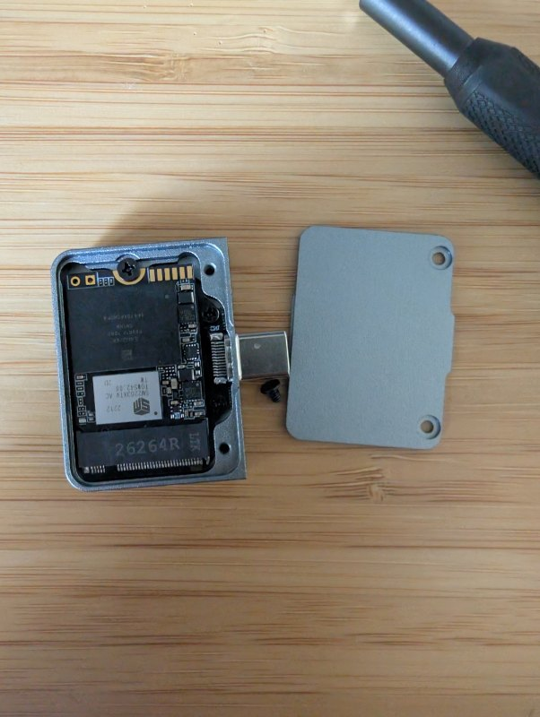

That is the whole assembly, opened up: the 2230 drive screwed down inside the
shell, the USB-C plug part of the enclosure rather than part of the drive, and a
backplate held on by one screw. Building a cartridge is this once — after that
the plate goes back on and the only thing that ever meets a port again is the
enclosure's own connector.

That trade-off does **not** mean giving up useful speed. 10 Gbps over USB 3.2
Gen 2 is around 1 GB/s in practice — already ahead of what a 2.5" SATA SSD can
deliver, and far beyond Switch-cartridge or SD-card territory. The aluminium
body doubles as the heatsink, which matters when a game is streaming assets off
it for hours.

| Medium | Practical read speed | What runs comfortably | Notes |
|---|---:|---|---|
| **USB 3.2 Gen 2 enclosure + 2230 NVMe** | **~800–1000 MB/s** | Indies, emulators, AA games, older AAA games, and many modern installs | The USB link is not the bottleneck here; drive quality and thermals usually matter more |
| **2.5" SATA SSD** | ~500–550 MB/s | Most PC games, including many large installs | Still slower than a 10 Gbps USB NVMe enclosure |
| **Nintendo Switch game card** | ~50–100 MB/s | Games built and optimised around console-style asset budgets | Much slower, but the software is designed for it |
| **UHS-I SD / microSD** | ~30–90 MB/s | Retro libraries, indies, lightweight PC games, emulators | Fine for small assets; weak for large modern PC installs |

So the practical answer is: the **adapter is the durability win**, and USB 3.2
is still fast enough that the cartridge remains a real play-from-media device
rather than just cold storage.

For this build, cheap refurbished bulk 2230 drives are a value play, not a
promise of flagship performance. They should be perfectly usable for indies,
retro, emulation, smaller AA releases and plenty of older AAA games, but the
newest asset-streaming-heavy PC blockbusters may still be happier on a strong
internal NVMe if a bargain cartridge drive cannot keep up.

Nothing here is specific to NVMe or to 2230. Any removable storage your OS will
automount works: 2.5" SATA SSDs in a dock, SD cards, USB sticks, external HDDs.
The form factor is a comfort choice, not a technical one.

</details>

<a id="cartridge-format"></a>
<details>
<summary><b>Cartridge format</b> — the one file a cartridge needs, by hand</summary>
<br />

A cartridge is a text file and some art, so you can make one by hand. Copy
`cartridge.conf.example` to the root of the drive as `cartridge.conf`:

```ini
executable=steam://rungameid/1091500
title=Cyberpunk 2077
cover=cover.jpg
```

Portrait art at 3:4 fills the launcher window exactly. A finished cartridge:

```
CARTRIDGE/
├── cartridge.conf
├── cover.jpg
├── autorun.inf          drive name and icon in Explorer
├── Games/               a copied non-Steam game
│   └── Tunic/
│       └── TUNIC.exe
└── steamapps/           a copied Steam game
    ├── appmanifest_367520.acf
    └── common/Hollow Knight/
```

`executable=` takes any URI the OS can handle — `steam://`, `heroic://`, `gog://`,
`epic://`, `playnite://`, `lutris://`, `http://`, `https://` — or a path to a file
on the cartridge. See `cartridge.conf.example` for every key.

A classic `autorun.inf` is also read, for `label` and `icon` only. Its `open=`
and `shellexecute=` keys are deliberately ignored: Windows has ignored them on
non-optical media since Windows 7, and they are the oldest autorun malware vector
there is.

</details>

<a id="setup"></a>
<details>
<summary><b>Setup and install</b> — prerequisites, and the two shapes of Linux install</summary>
<br />

### Prerequisites

Rust (stable) and Node 18+, plus a C toolchain.

```bash
# Linux
sudo apt install libgtk-3-dev libwebkit2gtk-4.1-dev librsvg2-dev libssl-dev

# Windows: Visual Studio Build Tools, "Desktop development with C++"
```

### Build and install

```bash
git clone https://github.com/HarryBMa/pc-gamepak.git
cd pc-gamepak
cd tauri-ui && npm install && npm run build && cd ..
```

**Linux** — two shapes, and you pick by which script you run:

```bash
sudo linux/install.sh       # 1) the system install   (recommended)
linux/install-user.sh       # 2) install without root
```

**1 — the system install.** A udev rule, two systemd template units, the helpers
and the launcher. udev is already running as part of the OS, so **nothing is
resident**: no process of ours exists until a cartridge is plugged in. Needs your
password once.

**2 — the rootless install.** Everything under `~/.local/bin`, plus a systemd
*user* service. No password, no udev rule, nothing written outside your home. In
exchange a small watcher stays running — about **2 MB, blocked in `poll()` on the
mount table**, no CPU while it waits.

Pick 1 unless you have a reason: zero is a better number than two megabytes. Pick
2 if you would rather not give a game launcher root, if you are on a machine
where you do not have it, or if you are installing from a sandboxed package,
which cannot write a udev rule at all.

They are not two codebases — the same launcher, the same detection rules, a
different trigger. The rootless one is arguably the more accurate of the two: it
wakes when the cartridge is *mounted and readable*, where udev fires when the
kernel first sees the partition and the helper then waits up to a minute for the
desktop to catch up.

```bash
# What the rootless install did, if you want to look:
systemctl --user status pc-gamepak-watcher.service
tail ~/.local/state/pc-gamepak/watcher.log
```

**Windows**

```powershell
cd watcher; cargo build --release; cd ..
# Right-click windows/install.ps1 → Run with PowerShell
```

Installs the watcher and launcher to `%LOCALAPPDATA%\PC-GamePak` and
registers a logon task.

**Platforms:** Windows and Linux. macOS is not supported — there is no watcher,
no installer and no icon set for it, so rather than ship something half-working
the macOS branches were removed.

</details>

<a id="uninstall"></a>
<details>
<summary><b>Uninstall</b> — putting the machine back</summary>
<br />

Run the installer menu and choose Uninstall. It removes the udev rule and systemd
units on Linux, or the logon task and install folder on Windows.

</details>

<a id="how-it-works"></a>
<details>
<summary><b>How it works</b> — insertion to launcher, and what it costs while idle</summary>
<br />

```
drive plugged in                          tag put on a reader
      │                                         │
      ├─ Linux    udev ──▶ systemd unit         └─ watcher, blocked in PC/SC,
      └─ Windows  watcher sees the volume          asks the reader for the UID
      │                                         │
      ▼                                         ▼
is there a cartridge.conf at the root?    is there one in tags/<UID>/ ?
      │                    ╰──no──▶  nothing happens  ◀──no──╯
      │ yes                                     │ yes
      ╰───────────────────────┬─────────────────╯
                              ▼
launcher opens with the cover art
      │
      ├─ Play   ──▶ starts what cartridge.conf names, then minimises
      └─ Eject  ──▶ flushes, unmounts, powers the drive down
```

**Nothing on a cartridge is executed automatically.** The launcher shows you what
it found and waits — pressing Play is the gate. That is the whole security model,
and it is why there is no trust list or allowlist to maintain.

### Idle cost

The point of a thing that waits all day for a drive is that it costs nothing
while it waits.

| | Idle |
|---|---|
| **Linux** | **Nothing resident** with the system install: udev is already part of the OS, and the rule adds no process. The rootless install trades that for one process of about 2 MB, blocked in `poll()` on the mount table. |
| **Windows** | **One process, ~2 MB, 0% CPU.** `pc-gamepak-watcher.exe` blocks on the Windows message queue — no polling, no timer. |
| **[Tags](#tags)** | Only when switched on: one extra thread in that process, blocked in PC/SC, plus whatever the reader library maps in. Still no timer and no polling. It wakes every thirty seconds to re-check which readers exist, which costs one syscall. |

The launcher is a webview, so it is not small *while it is on screen* — expect
around 100 MB for the few seconds it is up, then it exits and gives all of it
back. There is no tray icon and no background service for the UI.

The watcher ignores a second arrival on the same drive letter within 4 seconds,
so a cartridge that is ejected and immediately re-inserted may require a brief
pause before the launcher reopens.

</details>

<a id="security"></a>
<details>
<summary><b>Security</b> — nothing runs without a click</summary>
<br />

Nothing on a cartridge runs without a click. That is the model. Earlier versions
of this idea auto-executed a `launch.sh` on insert, which needed a SHA-256
allowlist to be safe at all; removing the auto-execution removed the need for the
allowlist along with it.

- **Play runs what `cartridge.conf` says.** If `executable=` names a binary on the
  drive, Play runs that binary. On your own cartridges that is the feature. On a
  drive someone hands you, read the conf first — or keep to `steam://`-style URIs,
  where the argument goes to a program you already trust.
- **The launcher window cannot read your disk.** The webview has no filesystem
  access and no command that takes a path. The cover is read in Rust, from a path
  confined to the cartridge, and passed in as a `data:` URI.
- **Nothing is fetched**, with the optional SteamGridDB integration switched off.
  Fonts are bundled, the cover is inlined, and the content-security policy is
  `default-src 'self'`. The launcher never has a reason to reach the network at
  all; only the wizard does, and only once you have turned the lookup on and
  given it a key.
- **Titles are text, never markup.** They come off an untrusted volume and are
  inserted with `textContent`.
- **Eject cannot pull a drive out from under a running game.** It takes an
  exclusive lock before unmounting, which a volume with an open handle on it
  will not give — so a game still running makes the eject fail and say what to
  close, rather than being talked out of it by a dialog.

- **Quit on the tray menu stops the watcher**, and nothing restarts it until the
  next logon. Plugging a cartridge in after that does nothing at all, which is
  the intended reading of Quit.

### Cartridges in Steam's library list

A cartridge you copied a Steam game onto is registered in `libraryfolders.vdf`,
labelled `PC GamePak`. Those entries are never removed automatically: a
cartridge is *meant* to spend most of its life unplugged, so a missing folder is
the normal state rather than stale cruft. When you reformat or repurpose one, the
wizard offers **Remove this drive from Steam's library list**.

Either way Steam has to be closed, because it keeps that list in memory and
writes it back out on exit — an edit made underneath a running Steam is simply
overwritten. **Close Steam if it is in the way** (ticked by default, and only
shown when the drive is or is about to be a Steam library) asks Steam to shut
itself down and waits for it. That is a request, not a kill: Steam flushes
`libraryfolders.vdf` and its download state on the way out, and killing it
mid-write to its own config is how the file we came to fix gets corrupted. If it
has not gone within 25 seconds the build stops and says so — and because this
runs before the format, nothing has been changed yet.

</details>

<a id="working-on-it"></a>
<details>
<summary><b>Working on it</b> — the crate split, the tests, the layout</summary>
<br />

The logic lives in `core/` (crate `gamepak-core`), deliberately free of any UI
dependency, so the tests run anywhere:

```bash
cargo test --manifest-path core/Cargo.toml
```

That split is the point: the Tauri binary cannot be compiled without webkit2gtk
and a display, so tests living inside it could not run in CI or on a
contributor's machine.

CI runs that suite plus clippy and rustfmt, compiles the watcher on Linux and
Windows, `cargo check`s the launcher on both, parses the frontend JavaScript, and
verifies every element the scripts reach for exists in the HTML — the UI ships
unbundled, so a missing id is a runtime crash rather than a build error.

```
cartridge.conf.example      the one file a cartridge needs
core/                       cartridge logic, no UI — this is where the tests are
linux/                      udev rule, systemd units, the user service, helpers,
                            and install.sh / install-user.sh
windows/                    install.ps1, uninstall.ps1, eject.ps1
watcher/                    volume watcher: WM_DEVICECHANGE on Windows, the
                            mount table on Linux (rootless install only)
tauri-ui/                   one binary, two windows (Tauri 2 + Rust, no framework)
  app/                      the HTML, CSS and JS, shipped unbundled
  src-tauri/                commands and window construction
packaging/                  AUR and Scoop manifests
tools/                      icon generation, DOM-id check
docs/                       screenshots, PUBLISHING.md, STATUS.md
```

[`docs/STATUS.md`](docs/STATUS.md) is the working inventory: what each module is
for, what is built, and what is missing.

When a cartridge does not open the launcher, the logs are the first place to
look: `%LOCALAPPDATA%\PC-GamePak\watcher.log` on Windows,
`~/.local/state/pc-gamepak/helper.log` on Linux.

</details>

<a id="packages"></a>
<details>
<summary><b>Packages</b> — where this will be published, and why not everywhere</summary>
<br />

Nothing is published yet. When it is, the shortlist is the AUR (which is where
the Steam Deck and Arch audience is), WinGet and Scoop on Windows — the channels
that can actually install the udev rule or the logon task this depends on.

[`docs/PUBLISHING.md`](docs/PUBLISHING.md) has the reasoning, including why
Flatpak, Snap and Homebrew are not on that list yet and what would change it.

</details>

<a id="thanks"></a>
<details>
<summary><b>Thanks</b> — the project this forked from, and others on the same idea</summary>
<br />

This project began as a fork of
**[LewdM3at/PC-cartridge-system](https://github.com/LewdM3at/PC-cartridge-system)**,
which had the original idea and the first working implementation: the udev rule,
the systemd template unit and the Windows monitor that make insert-detection work
at all. The shape of the Linux side is still recognisably theirs.

That project is built around 2.5" SATA SSDs and has 3D-printable cartridge shells
on [MakerWorld](https://makerworld.com/en/models/3057977-2-5-ssd-dock-cartridge-system) — worth a look if you
want the full physical-cartridge build rather than a pocket enclosure.

This fork diverges in a few ways: 2230 NVMe rather than 2.5" SATA, a Tauri
launcher and a create-cartridge wizard instead of per-game shell scripts, and a
click-to-play model in place of the auto-execute-plus-allowlist one.

### Others working on the same idea

**[TheStockPot/NFC-Cartridge-Player](https://github.com/TheStockPot/NFC-Cartridge-Player)**
is where the tag idea above comes from, and it is worth seeing on its own terms:
an ESP32 and an RC522 in a 3D-printed shell, reporting tag IDs to Home Assistant,
which then dims the lights and starts the film. It is a smart-home project rather
than a PC one, and no code is shared with it — its licence is GPL-3.0 against our
MIT — but [the line-source protocol](#tags) exists so hardware built to that guide
can drive this launcher instead.

**[Uplinkpro/CartLaunchCompanion](https://github.com/Uplinkpro/CartLaunchCompanion)**
takes the opposite half of this problem, and takes it further than this project
does. It is a fullscreen, controller-first launcher — Avalonia and .NET, with
trailers and shelves — that lives **on the cartridge itself**, so a drive works
on a machine that has never been prepared. You lay the drive out yourself and its
configurator writes a `game.json` per game.

Where PC GamePak differs: the launcher is installed on the PC and the cartridge
carries only data, so a cartridge stays a text file and some art; and there is a
wizard that *makes* one — formatting, copying the game across, registering it as
a Steam library — which CartLaunchCompanion leaves to you. If you want a console
UI on a drive you assemble by hand, look there. Note its licence is PolyForm
Noncommercial, not MIT, so code cannot move between the two projects.


</details>

<a id="licence"></a>
<details>
<summary><b>Licence</b> — MIT</summary>
<br />

MIT, inherited from the upstream project. See [`LICENSE`](LICENSE) — the original
copyright notice is retained as the licence requires.

</details>

<a id="disclaimer"></a>
<details>
<summary><b>Disclaimer</b> — a hobby project</summary>
<br />

A hobby project, not affiliated with Valve, Steam, Playnite or ITGZ.

Auto-detection depends on your OS automounting removable drives. Some setups need
that configured before any of this works.

Use at your own risk.

</details>
