# Skin examples

Fifteen worked skins. None of them ship inside the launcher — copy one onto a
cartridge and it wears it:

```
H:\.gamepak\skin.css
```

Then replug the cartridge. [`../SKINNING.md`](../SKINNING.md) is the reference:
the elements a skin styles, the two layers it owns, the states, and what the
content security policy forbids.

### luna

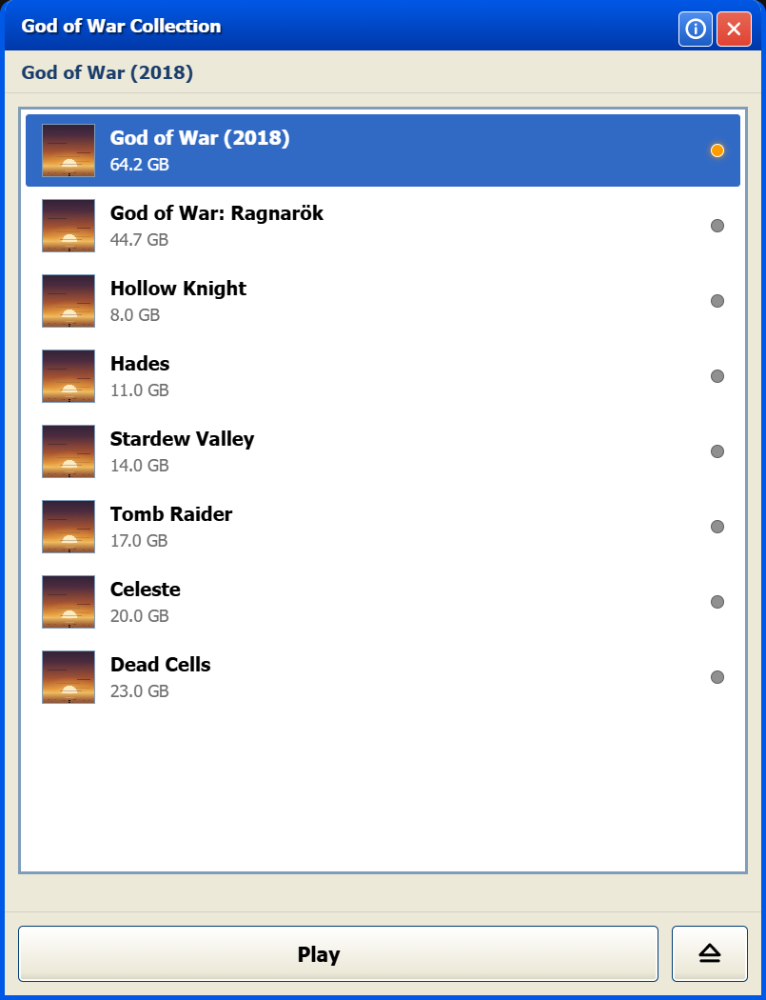

Explorer, about 2003. A title bar, a white pane, and every game's icon at 32px. The only one that shows no artwork at all.

[`luna.css`](luna.css)

### retro

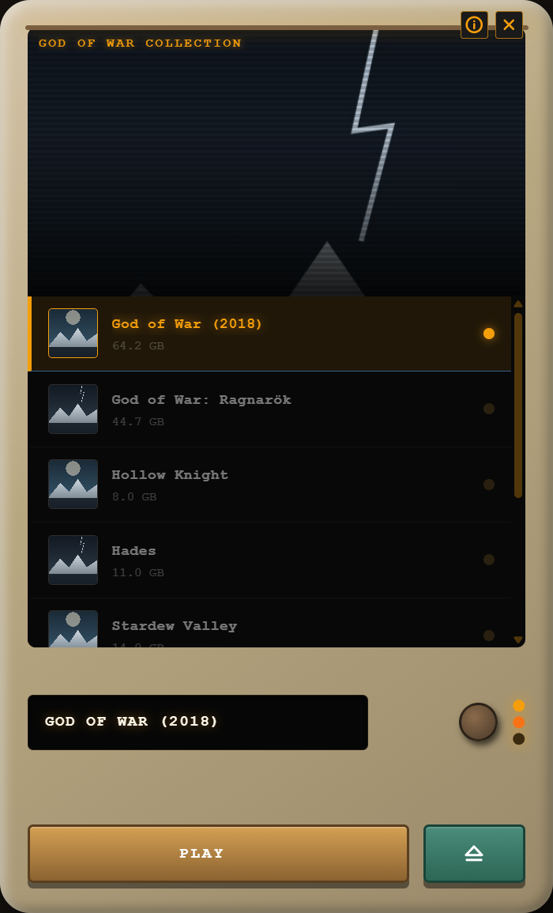

A wood-grain television. The screen is set into the cabinet, the hero plays on it, and the knobs and lamps are drawn on a layer the skin owns.

[`retro.css`](retro.css)

### cyberpunk

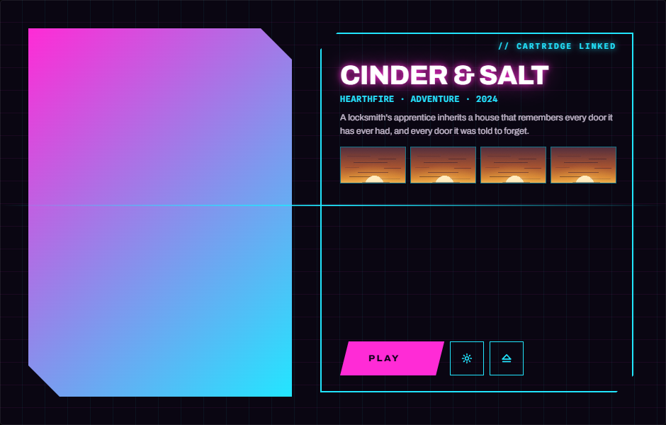

Wide and split. Titles down the left, the hero filling the right, and the selected game's logo printed over it.

[`cyberpunk.css`](cyberpunk.css)

### phantom

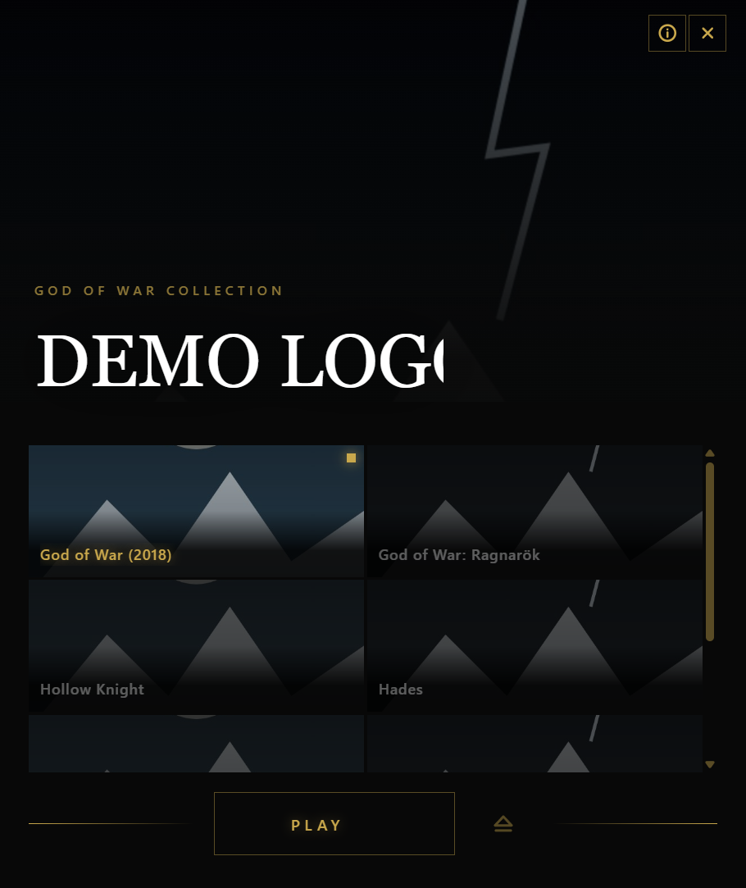

Black and gold. A hero band across the top, a two-up grid under it, and nothing else. Up and down move by two.

[`phantom.css`](phantom.css)

### desktop

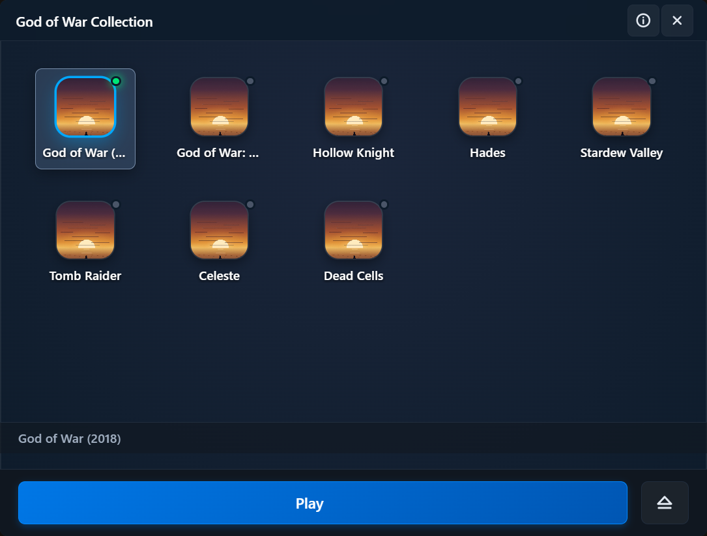

Games as a grid of shortcuts with a taskbar. Asks for icons rather than covers, and the row width is measured, so the pad moves by a row.

[`desktop.css`](desktop.css)

### arcade

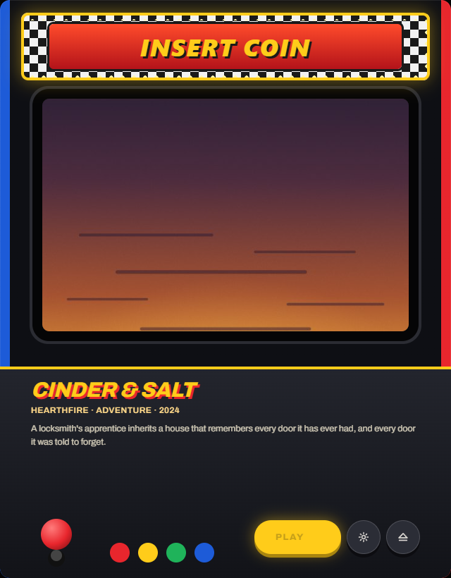

A cabinet. Scanlines and a marquee, the games run sideways, and the two buttons are domes that drop onto their own plastic.

[`arcade.css`](arcade.css)

### cozy

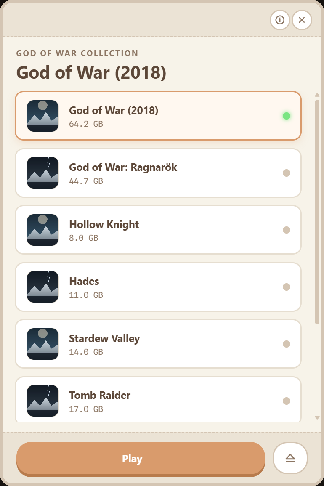

Cream and rounded. The light one, with the artwork kept out of it and Play sitting on a shadow it presses into.

[`cozy.css`](cozy.css)

### bigpicture

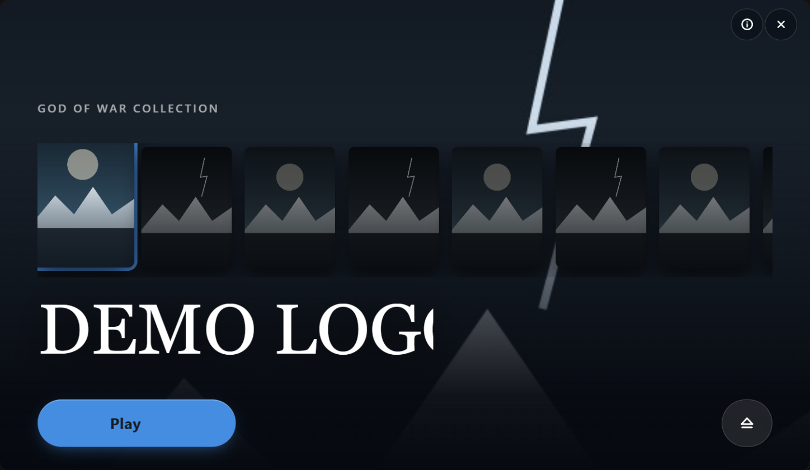

A hero behind, covers along the bottom, the logo in front. The one the three art slots exist for.

[`bigpicture.css`](bigpicture.css)

### bricolage

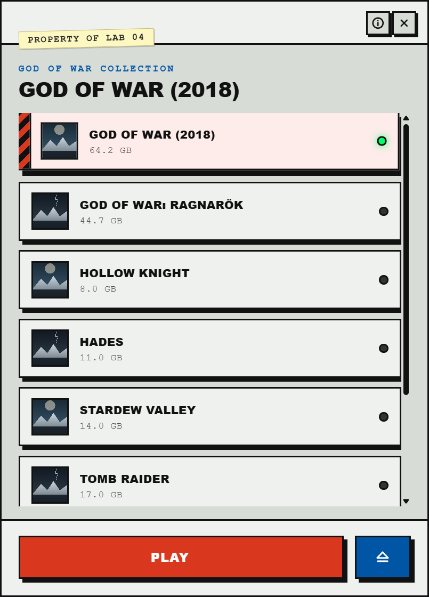

Lab bench equipment. Label-maker tape hanging off the header, hard black offset
shadows, and hazard stripes down the row that is live. Shows no fill artwork at
all — the covers are specimens in a rack.

[`bricolage.css`](bricolage.css)

### phosphor

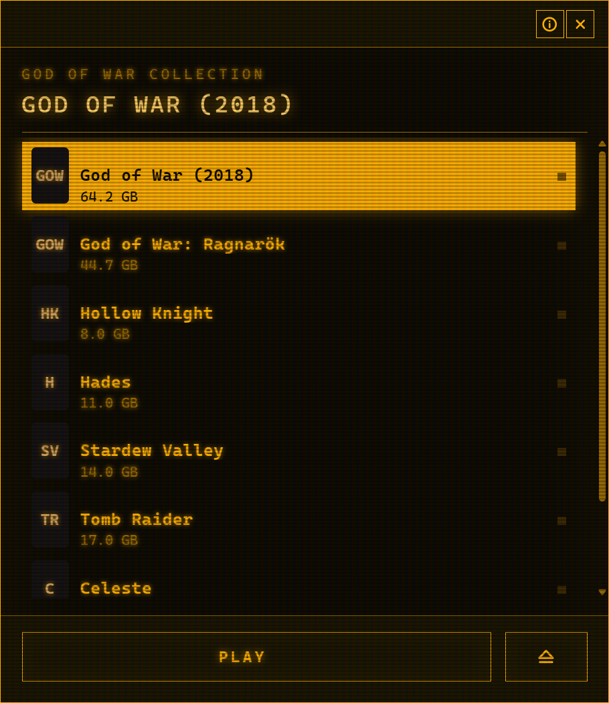

An amber terminal from 1984. The only skin with `--skin-row-art: none`, so the
rail is type and initials rather than pictures, and the scanlines are drawn on
the layer above everything. A disk array listing, not a shelf.

[`phosphor.css`](phosphor.css)

### atomic

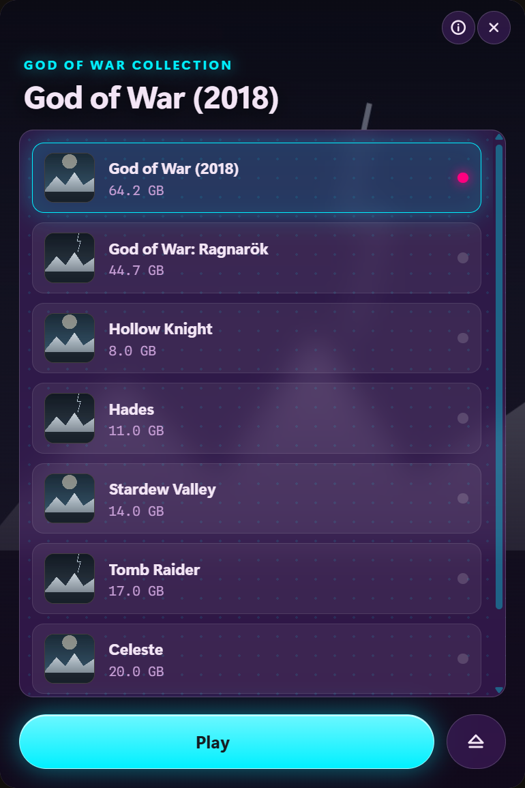

Translucent purple plastic, 1999. The only one that puts `backdrop-filter`
between the interface and the artwork, so the hero shows through the frosted
chassis with the circuit dots printed on it.

[`atomic.css`](atomic.css)

### akihabara

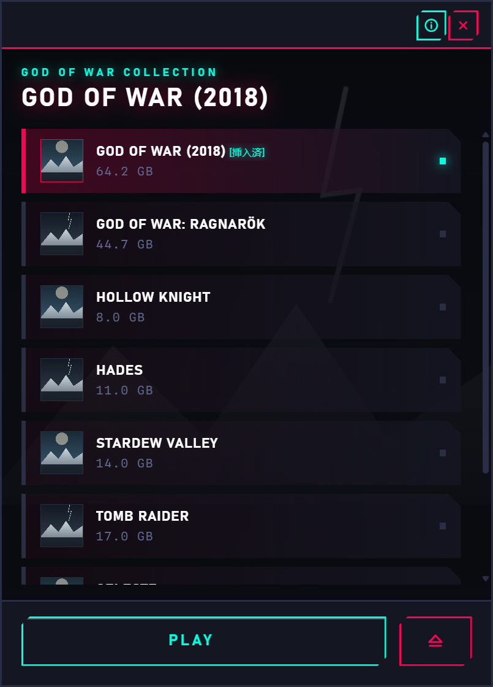

A slot loader. Every panel is notched with `clip-path`, the rail is a stack of
loading bays lit down one edge, and the row that is loaded gets a kanji state
badge.

[`akihabara.css`](akihabara.css)

### shelf

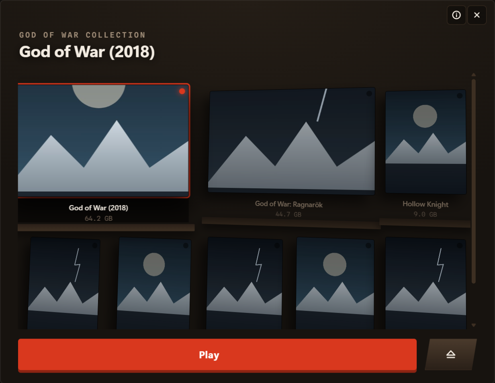

Game boxes standing on a shelf, seen at an angle. A grid with `perspective`,
every box turned in 3D, and the big installs taking two columns — the first
skin to lay out from `data-size` rather than from position.

[`shelf.css`](shelf.css)

### jukebox

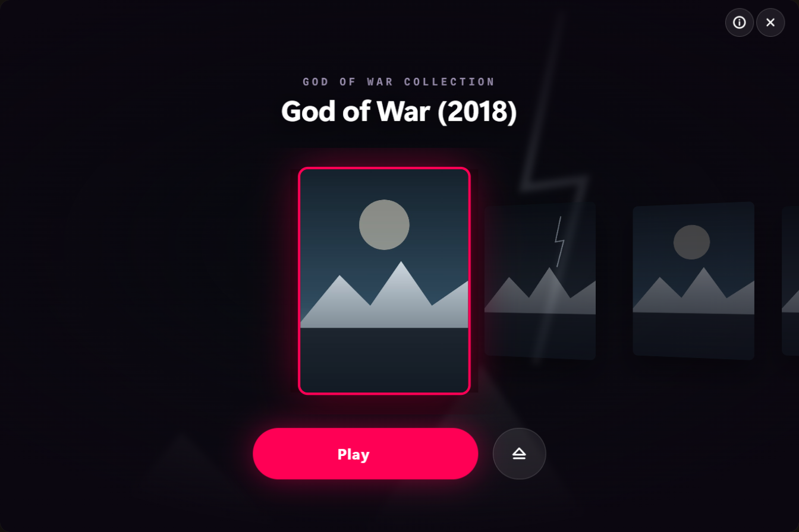

A wheel of covers turning around the one in front. The sibling combinator does
the work: everything after the selected row leans one way and everything before
it leans the other, which is what makes it a wheel and not a row of tilted
cards.

[`jukebox.css`](jukebox.css)

### eurorack

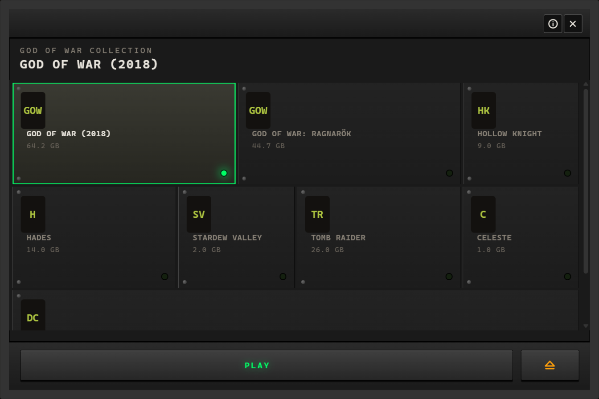

Modules bolted across rails in unequal widths. Fixed height, variable width
from `data-size`, screws in the corners and a panel LED on the plate that is
live. The only skin whose rows are neither a column nor a grid — they wrap.

[`eurorack.css`](eurorack.css)

Every one of those is the same launcher with the same markup. What changes is
the window's size, the shape of the list, which of the four artworks is asked
for in each of the three places one can go, and whether the result reads as a
poster, a file window or an appliance.

The screenshots are of the sample cartridge in the browser preview, taken
through the same path a real drive takes: the stylesheet is handed to the
launcher as the cartridge's own, and nothing else about the build changes.

## Trying one without a cartridge

The launcher runs in a browser with a sample cartridge, which is a faster loop
than writing a drive:

```bash
python -m http.server 8731        # from the repository root
```

```
localhost:8731/tauri-ui/app/index.html?drive=D:\&state=bundle&skin=retro
```

`&skin=` hands the launcher that file as if the cartridge were carrying it, so
this is the same path a real drive takes. `&state=bundle` gives you a collection
so the list is real. Edit the file and reload.
