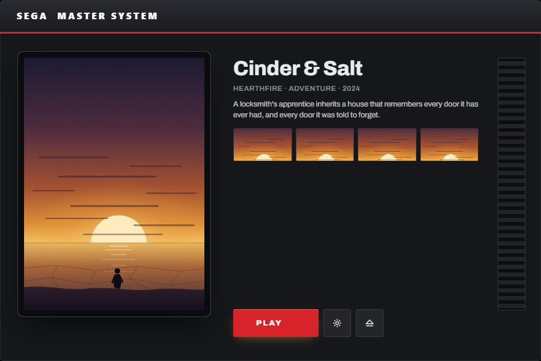
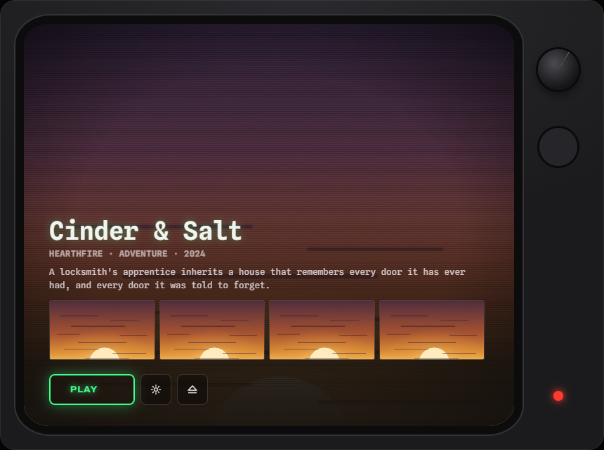
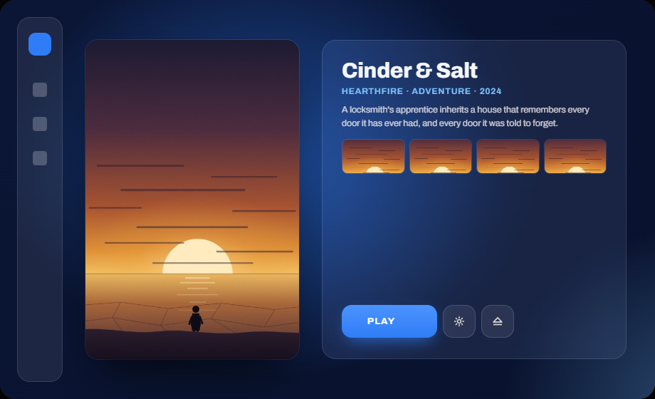
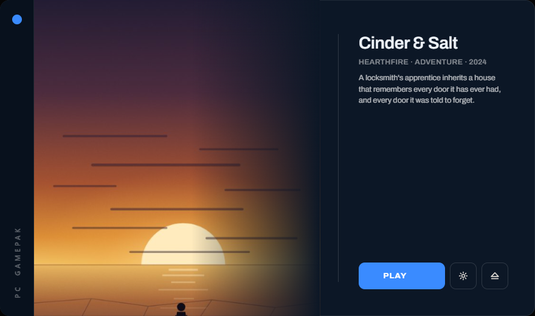
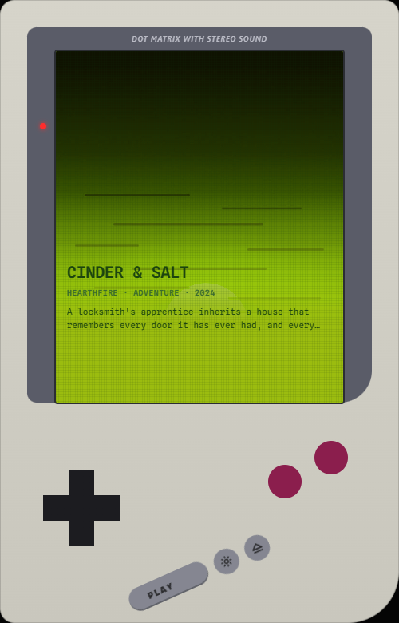
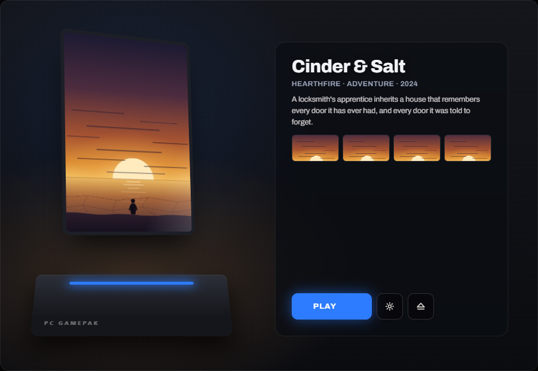
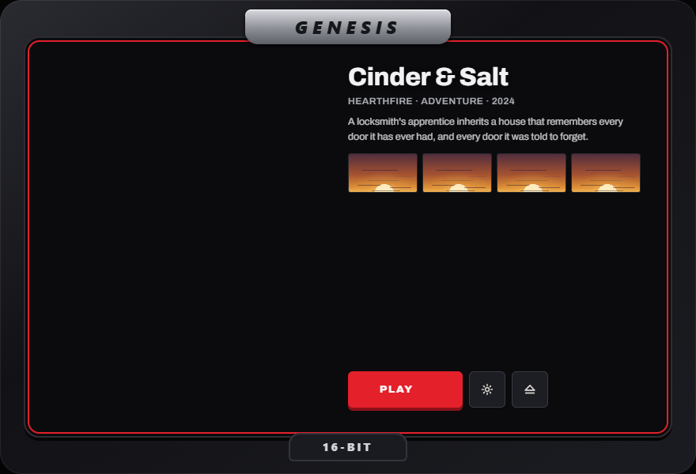

# Skin examples

Nine worked skins, one per console idea. None of them ship inside the launcher —
copy one onto a cartridge and it wears it:

```
H:\.gamepak\skin.css
```

Then replug the cartridge. [`../SKINNING.md`](../SKINNING.md) is the reference:
the elements a skin styles, the layers it owns, the states it can animate, the
sound sets it can ask for, and what the content security policy forbids.

Each of these sets its own **window size**, animates the **moments** a cartridge
goes through (`data-state` on `<body>`), and most ask for a **sound set**. Two
are deliberately silent.

---

### master-system



A console with the lid open. A black case with a red stripe across the top, a
louvred vent down the right, and the cartridge art seated in a slot on the left.
The power LED only lights once a cartridge is actually readable; launching
floods the window with the stripe's red.

900×600 · sound: `console`

[`master-system.css`](master-system.css)

---

### crt



A television on the carpet. The whole window is a wood-and-plastic set: a thick
bezel, a curved glass screen with scanlines rolling over it, and a column of
knobs on the cabinet beside the glass. Switching on opens the picture from a
horizontal line; Eject collapses it back to a dot, the way a tube does.

860×640 · sound: `crt`

[`crt.css`](crt.css)

---

### modern-glass



Clean and minimal. A deep blue room lit by two slow-moving glows, a frosted icon
rail down the left, the cover as a floating card, and the details on a panel
beside it. The only motion is a soft rise on arrival and a press on launch:
restraint is the design, so the moments are quiet rather than absent.

920×560 · sound: `console`

[`modern-glass.css`](modern-glass.css)

---

### arcade


A cabinet in the corner of a pizza place. Tall, because a cabinet is: a lit
marquee across the top with chase lights running under it, the art in a bezelled
monitor, and a control deck with a ball-top stick and four buttons along the
bottom. The marquee strikes on like a tube starting.

640×820 · sound: `arcade`

[`arcade.css`](arcade.css)

---

### cyberpunk


Dynamic and animated. Neon on near-black: magenta and cyan edges cut at angles,
the art behind a clipped frame, a scanning line sweeping the whole window
continuously. The most animated of the nine — it exists to show ambient motion
and state motion working together. Launch tears the picture chromatically before
it goes.

940×600 · sound: `neon`

[`cyberpunk.css`](cyberpunk.css)

---

### minimal



Focused. Almost nothing: the art large on the left bleeding to the edge, a
single hairline, the game named in quiet type, and one filled button. The window
is wide and short so the emptiness is the point.

880×520 · sound: `handheld`

[`minimal.css`](minimal.css)

---

### handheld



A pocket console with a green screen. A grey plastic shell, portrait, with a
four-shade green LCD — the art is pushed through a filter until it is four
greens. A D-pad and the A/B buttons sit below it. The screen boots with the logo
sliding down, ghosts faintly while it sits, and inverts twice on launch.

500×780 · sound: `handheld`

[`handheld.css`](handheld.css)

---

### 3d-console



Immersive. A cartridge standing in the slot of a console on a lit desk. The
cover is tipped back in perspective so it reads as a physical object, drifting
very slightly the whole time. Launching turns it to face you and brightens it
out.

900×620 · sound: `console`

[`3d-console.css`](3d-console.css)

---

### genesis



A frame made for the game. The window becomes the face of a 16-bit console: a
black moulded frame with a red accent line, a raised nameplate at the top and a
spec tab at the bottom. This is the one to copy when a cartridge wants its *own*
housing — four colour variables away from being a different machine.

880×600 · sound: `arcade`

[`genesis.css`](genesis.css)

---

## Seeing one without a cartridge

Serve the repository root and hand the launcher a skin by name:

```bash
python -m http.server 8731
```

`localhost:8731/tauri-ui/app/index.html?drive=D:&state=described&skin=crt`

`&state=described` fills in the description, byline and screenshots. Leave it
off and the cartridge says nothing, which is what most cartridges do — judge a
skin against both.
